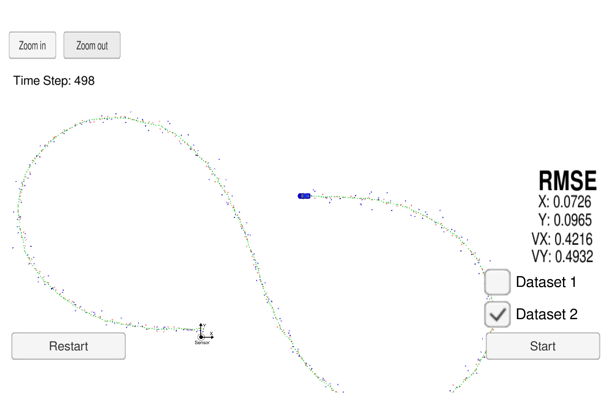

# Extended Kalman Filter State Estimation
---

## Overview
In this project have utilized kalman filter to estimate the state of a moving object of interest with noisy lidar and radar measurements. I have met the passing requirements by obtaining RMSE values that are lower than the tolerance outlined in the [project rubric](https://review.udacity.com/#!/rubrics/748/view). This project involves the Term 2 Simulator which can be downloaded [here](https://github.com/udacity/self-driving-car-sim/releases).

Here is the main protocol that main.cpp uses for uWebSocketIO in communicating with the simulator.

| **INPUT** | Definition |
|:---------:|:---------:|
|sensor_measurement|Lidar and/or Radar measurments observed in simulator|

| **OUTPUT** | Definition |
|:---------:|:---------:|
| estimate_x | Kalman filter estimated position x |
| estimate_y | Kalman filter estimated position y |
| rmse_x | Difference between ground truth data for position x and estimate_x |
| rmse_y | Difference between ground truth data for position y and estimate_y |
| rmse_vx | Difference between ground truth data for velocity x and estimate_vx |
| rmse_vy | Difference between ground truth data for velocity y and estimate_vy |

---

## Dependancies

* Udacity Term 2 Simulator
* cmake >= 3.5
* make >= 4.1
* gcc/g++ >= 5.4

## Basic Build Instructions

1. Clone this repo.
2. Make a build directory: `mkdir build && cd build`
3. Compile: `cmake .. && make` 
4. Run it: `./ExtendedKF `

## Generating Additional Data

If you'd like to generate your own radar and lidar data, see the
[utilities repo](https://github.com/udacity/CarND-Mercedes-SF-Utilities) for
Matlab scripts that can generate additional data.

## Project Execution Instructions 
Once `./ExtendedKF` binary is executed and the simulator is run, the following massage is shown which indicates that the code is waiting for the simulator toget started.

```sh
Listening to port 4567
Connected!!!
```

There are two datasets provided in the term2 simulator where it is aimed to have desirable performance on both of them. they differ in the following terms:

* Direction the car is moving
* The order the first measurement is sent to the extended kalman filter; Lidar is sent first for dataset 1, where radar is sent first for dataset 2.

| Dataset 1 | Dataset 2 |
|:---------:|:---------:|
|  |  |


