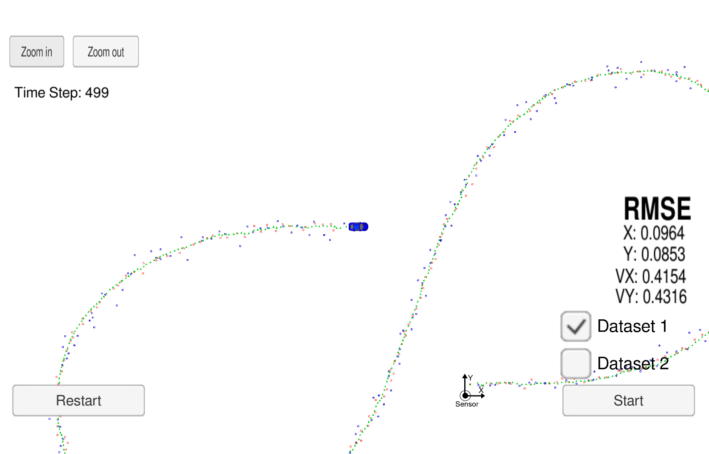
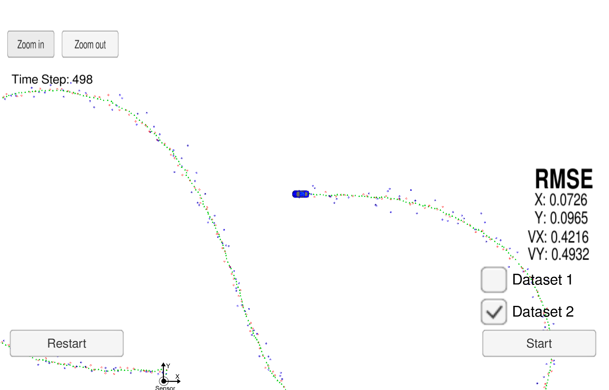

# Extended Kalman Filter State Estimation
---

## Overview
In this project have utilized kalman filter to estimate the state of a moving object of interest with noisy lidar and radar measurements. I have met the passing requirements by obtaining RMSE values that are lower than the tolerance outlined in the [project rubric](https://review.udacity.com/#!/rubrics/748/view). This project involves the Term 2 Simulator which can be downloaded [here](https://github.com/udacity/self-driving-car-sim/releases).

Here is the main protocol that main.cpp uses for uWebSocketIO in communicating with the simulator.

| **INPUT** | Definition |
|:---------:|:---------:|
|sensor_measurement|Lidar and/or Radar measurments observed in simulator|

| **OUTPUT** | Definition |
|:---------:|:---------:|
| estimate_x | Kalman filter estimated position x |
| estimate_y | Kalman filter estimated position y |
| rmse_x | Difference between ground truth data for position x and estimate_x |
| rmse_y | Difference between ground truth data for position y and estimate_y |
| rmse_vx | Difference between ground truth data for velocity x and estimate_vx |
| rmse_vy | Difference between ground truth data for velocity y and estimate_vy |

---

## Dependancies

* Udacity Term 2 Simulator
* cmake >= 3.5
* make >= 4.1
* gcc/g++ >= 5.4

## Basic Build Instructions

1. Clone this repo.
2. Make a build directory: `mkdir build && cd build`
3. Compile: `cmake .. && make` 
4. Run it: `./ExtendedKF `

## Generating Additional Data

If you'd like to generate your own radar and lidar data, see the
[utilities repo](https://github.com/udacity/CarND-Mercedes-SF-Utilities) for
Matlab scripts that can generate additional data.

## Project Execution Instructions 
Once `./ExtendedKF` binary is executed and the simulator is run, the following massage is shown which indicates that the code is waiting for the simulator toget started.

```sh
Listening to port 4567
Connected!!!
```

There are two datasets provided in the term2 simulator where it is aimed to have desirable performance on both of them. they differ in the following terms:

* Direction the car is moving
* The order the first measurement is sent to the extended kalman filter; Lidar is sent first for dataset 1, where radar is sent first for dataset 2.

| Dataset 1 | Dataset 2 |
|:---------:|:---------:|
|  |  |

## [Rubric points](https://review.udacity.com/#!/rubrics/748/view) 

### Compiling
The code compiles without errors with `cmake` and `make`.

### Accuracy
px, py, vx, vy output coordinates must have an RMSE <= [.11, .11, 0.52, 0.52] when using the file: “obj_pose-laser-radar-synthetic-input.txt which is the same data file the simulator uses for Dataset 1”

| data type | **Accuracy** |
|:----------:|:----------:|
| dataset 1 | *[0.0964, 0.0853, 0.4154, 0.4316]* |
| dataset 2 | *[0.0726, 0.0965, 0.4216, 0.4932]* |

The accuracy is satisfactory since in both datasets it is lower than the limit.

### Follows the Correct Algorithm
My Sensor Fusion algorithm follows the general processing flow as in src/kalman_filter.cpp. Prediction is implemented in line 142 of src/FusionEKF.cpp and lines 154-167 for update process. 

the Kalman filter algorithm developed in this project adequately handles both radar and lidar measurements through a process flow of first predicts, then updates. the measurements of two sources are divided into two stepsl first measurement and update process.

### Code Efficiency
Regarding the calculations are done first, then the variables are used directly in later steps. An exmple of this approach is calculing the following cariables first and use them directly in the process covariance matrix `Q`:

```sh
float dt_2 = dt   * dt;
float dt_3 = dt_2 * dt;
float dt_4 = dt_3 * dt;
```


